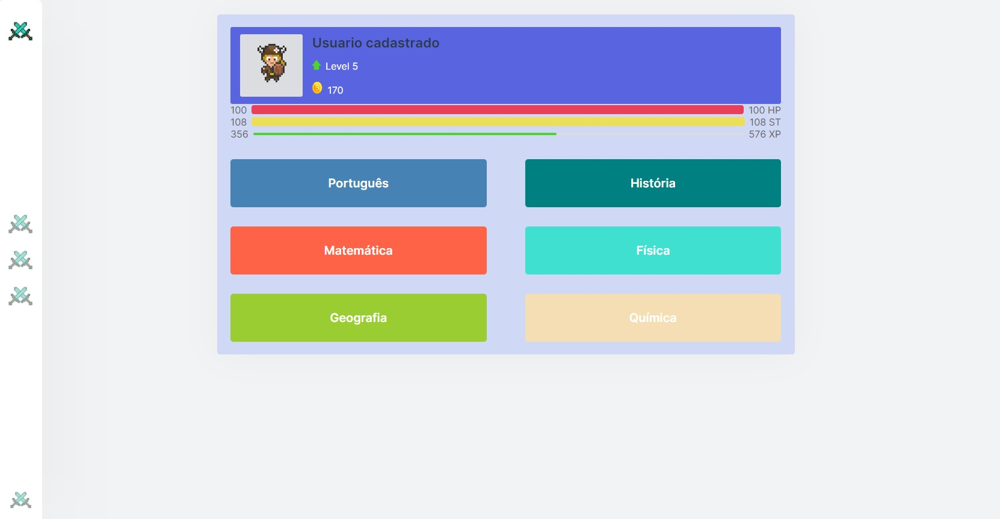
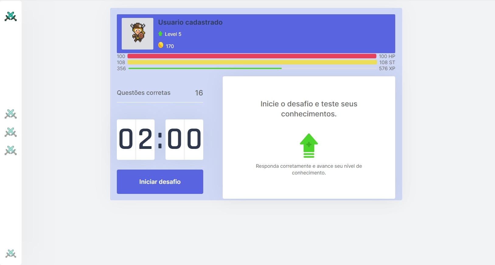
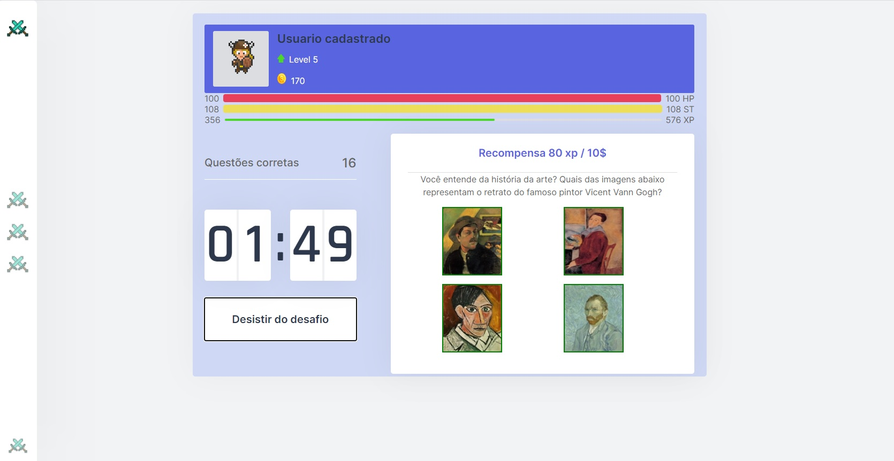
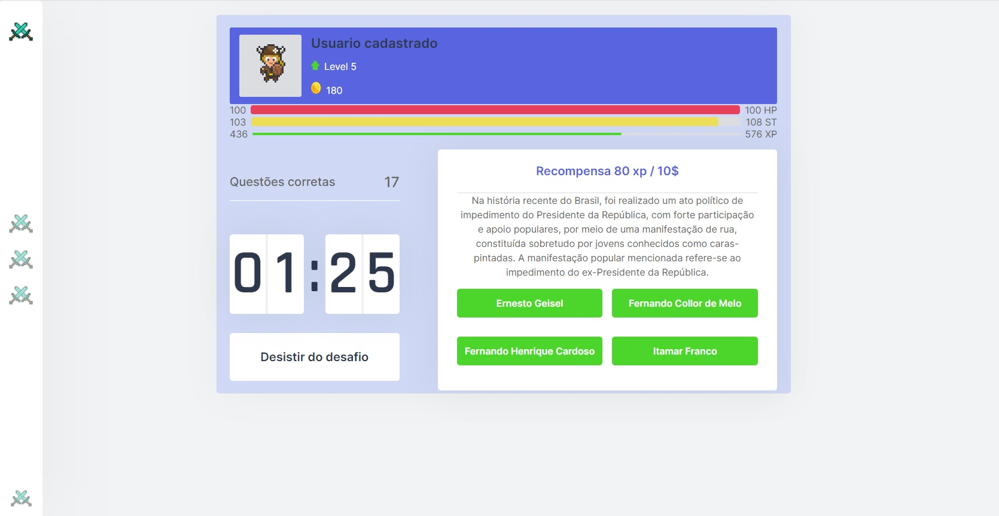
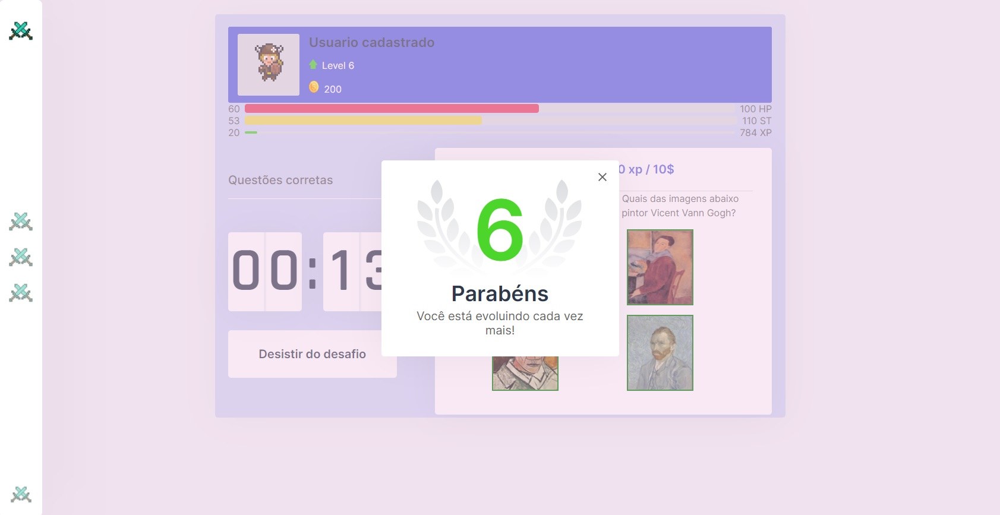
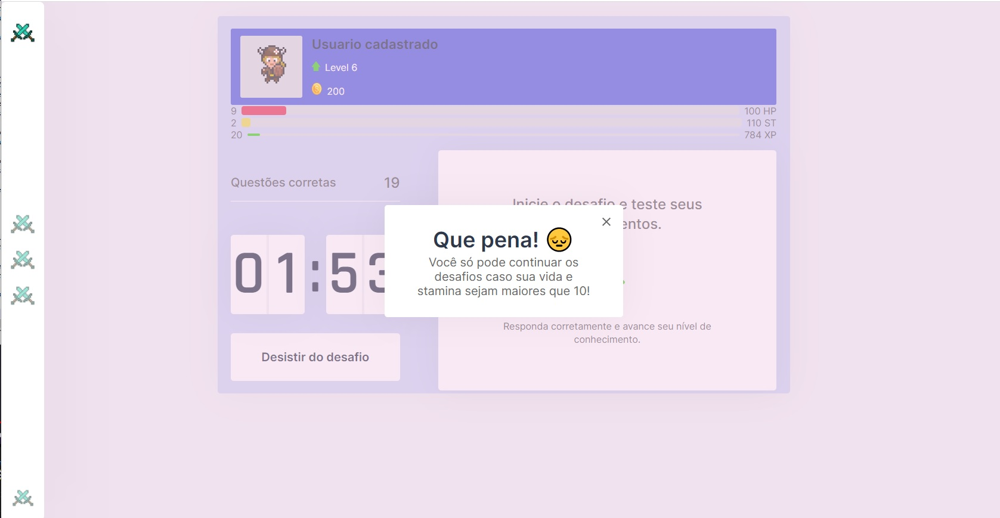

# Student guild

O projeto tem como intuito fornecer uma ferramenta de complemento de estudos para alunos do ensino fundamental de forma lúdica, utilizando elementos de gamificação.

Se trata de um aplicativo de teste de conhecimentos dentro de um ambiente que simula um jogo de RPG. O core da aplicação são os desafios das perguntas, onde ao responder corretamente o usuário será premiado e ao responder incorretamente será punido.

# Funcionalidades
* O jogador possui um avatar representativo personalizável atravéis de equipamentos.
* Seu progresso é representado pelo level alcançado ao responder continuamente os desafios.
* Cada desafio respondido corretamente fornece ao jogador uma quantia de experiência e uma quantia de dinheiro do jogo que pode ser utilzido na loja.
* É possível escolher as matérias dos desafios sendo elas: Português, Matemática, História, Física, Geografia e Química.
* O jogador possui três barras que são fundamentais ao jogo, todas as barras tem função de "progresso" reduzindo ou aumentando dependendo de seus valores.
  - Uma barra vermelha representando a vida do jogador.
    - Caso a vida chegue a zero, deve-se aguardar um tempo para que a vida seja recuperada [recuperação atual é de 1 ponto de vida por segundo].
      - A vida só é recuperada quando não há nenhum desafio ativo.
    - A vida do jogador é reduzida toda vez em que uma pergunta é respondida incorretamente [10 pontos de vida são perdidos por erro].
  
  - Uma barra amarela representando a estamina(vigor) do jogador.
    - Caso a estamina chegue a zero, deve-se aguardar um tempo para que a estamina seja recuperada [recuperação atual é de 1 ponto de estamina por segundo].
      - A estamina só é recuperada quando não há nenhum desafio ativo.
    - A estamina do jogador é reduzida toda vez que o jogador realiza uma ação dentro de um desafio.
      - Caso o jogador acerte uma questão, 5 pontos de estamina são reduzidos.
      - Caso o jogador erre uma questão, 10 pontos de estamina são reduzidos.
    - O jogador recebe um aumento no seu número máximo de estamina a cada novo level.
    
  - Uma barra verde representando a experiência do jogador
    - Toda vez que o jogador responde uma pergunta corretamente, o valor da experiência dessa pergunta é computado na barra de experiência e somado a ela.
      - Ao alcançar o valor máximo de experiência o level do jogador sera somado em 1 e a barra retornará ao inicio e somará o resíduo de experiência da recompensa.
      - A cada novo level é necessário uma número maior de experiência para o próximo.
* O desafio é representado por um contador onde as perguntas serão enviadas enquanto o contador estiver rodando
  - Caso o contador seja pausado, as questões desaparecem e o contador é resetado.
* O número de respostas corretas é apresentado acima do contador esse campo é acumulando continuamente
* O desafio é composto por questões que devem ser respondidas durante o tempo de contagem do contador
  - Existem 3 tipos de questões possíveis na aplicação
    - Questões de múltipla escolha escritas, onde o jogador deve escolher a resposta correta para a questão
    - Questões de entrada de dados podendo ter entradas de 1 a 4 campos. O jogador deve responder corretamente todos os campos e enviar a resposta.
    - Questões de imagens, o jogador deve escolher a imagem que representa o que foi pedido na questão.
* Ao passar de nível será aberta uma janela informando sua conquista.
* Ao ter sua vida ou estamina abaixo de 10, uma janela será aberta informando que você não pode continuar o desafio e as perguntas deixarão de aparecer na tela até o jogador acumular pelo menos 10 pontos em vida e estamina.

# Layout da aplicação
<h3>Core da aplicação</h3>

<h3>Questões</h3>

<h3>Janelas informando level up e impossibilidade de continuar</h3>

# Tecnologias
O projeto foi desenvolvido utilizando as seguintes tecnologias:
  * **[Typescript](https://www.typescriptlang.org/)**
  * **[ReactJS](https://pt-br.reactjs.org/)**
  * **[NextJS](https://nextjs.org/)**

#Quer testar o app?
A configuração mobile ainda está passando por ajustes
https://student-guild.vercel.app

# Rodando o Projeto
  Para clonar o repositório
  
      # Clone 
      $ git clone https://github.com/walmirrangel/StudentGuild

      # Acessar projeto no terminal/cmd
      $ cd StudentGuild
      
   Rodando app
   
      # Primeiro instalar as dependências
      $ yarn install

      # Executar o app em modo de desenvolvimento
      $ yarn dev

      # O servidor se inicia na porta 300 então é só acessar o link http://localhost:3000
   
